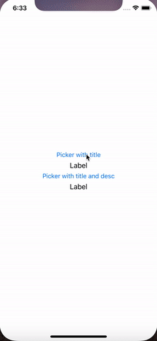

# SearchablePicker
###### A simple picker view with a search bar.
* Native-like behavior. 
* Two options to present:
  * Titles only.
  * Titles with descriptions.
* Available for iPhone and iPad.
* Support for iOS 9 and above.
* Objective-c

## Demo gifs ##
    


### Basic Usage ##
**For detailed examples, please download and try out this repo.**
```obj-c
NSArray *countries = [NSArray arrayWithObjects:@"Afghanistan", @"Georgia", @"Haiti", @"India", nil];

[SearchStringPickerViewController showPickerWithTitle:@"Countries"
                                                     rows:countries
                                         initialSelection:[colors indexOfObject:@"India"]
                                               sourceView:sender
                                                doneBlock:^(NSInteger selectedIndex, NSString *selectedValue) {
                                                    NSLog(@"Index: %@, value: %@", selectedIndex, selectedValue);
                                                }
                                              cancelBlock:nil 
                                presentFromViewController:self];                                
```
## Installation ##
###### Cocoapod and Carthage coming soon!

### Manually
Download the project and add [SearchablePicker](SearchablePicker/SearchablePicker) folder to your project.

## Motivation ##
Coming soon!

## Todo ##
- [ ] Insert motivation
- [ ] Add customizable bar color
- [ ] Implement alphabets indexing at the scroll bar
- [ ] Enable Cocoapod and Carthage support


